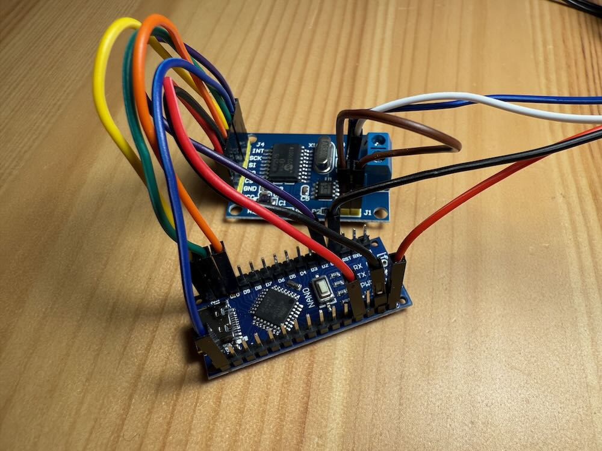

# CAN Helper

https://github.com/canhelper/canhelper

CAN-модуль на основе прошивки CAN Helper предназначен для решения проблемы, возникающей при соединении двух
CAN-адаптеров друг к другу напрямую. Без CAN-устройств на шине, адаптеры могут читать из шины, но попытка записи
завершается ошибкой.

Такой модуль представляет из себя компактное и легко собираемое CAN-устройство, которое вешается на шину.

CAN Helper поддерживает переключение скорости на лету. Для этого он слушает шину, и как только принимает нужное
сообщение — переключает скорость.

### Вам потребуется:

- Arduino Nano (рекомендую брать с USB type C)
- плата MCP2515. Лучше берите несколько штук с запасом. Можно подключить сразу две, будут работать две CAN-шины
  одновременно.
- соединительные провода
- питание 12 Вольт

### Сборка

- установите Arduino IDE: https://www.arduino.cc/en/software. При установке предложит установить все нужные драйвера.
- откройте в IDE файл canhelper.ino
- при необходимости, отредактируйте файл: можно поменять скорость подключения, также можно активировать CAN2 (смотрите
  раздел Настройки)
- подключите плату Arduino USB-кабелем к компьютеру
- в IDE выберите из списка вашу плату и появившийся виртуальный COM-порт, попробуйте залить прошивку
- если всё залилось без ошибок, отключите arduino от компьютера, и соедините платы, как показано в таблице:

| Arduino Nano | MCP2515 CAN1 | MCP2515 CAN2 (опционально) |
|--------------|--------------|----------------------------|
| +5V          | VCC          | VCC                        |
| GND          | GND          | GND                        |
| D10          | CS           | -                          |
| D9           | -            | CS                         |
| D12          | SO           | SO                         |
| D11          | SI           | SI                         |
| D13          | SCK          | SCK                        |
| D2           | INT          | INT                        |
| -            | перемычка J1 | -                          |
| -            | -            | перемычка J1               |

- не забудьте установить перемычку J1 на MCP2515
- подключите MCP2515 к CAN-шине
- подключите (-) от источника питания к Arduino, пин GND (на плате два пина GND)
- подключите (+) от источника питания 12 Вольт к Arduino, пин VIN
- на Arduino и MCP2515 загорятся лампочки
- готово! Пробуйте что-нибудь записать в шину вашим CAN-адаптером. Теперь должно записывать без ошибок.

### Настройки

В canhelper.ino можно поменять следующие настройки:

- #### Выбор скорости подключения

По-умолчанию CAN1 работает на скорости 500000 бит в секунду.
Если вы подключаетесь на другой скорости, вам надо указать нужную скорость в прошивке. Для этого отредактируйте параметр
CAN1_BAUD_RATE.

Пример, 500000 бит/с:

```
#define CAN1_BAUD_RATE 500000
```

125000 бит/с:

```
#define CAN2_BAUD_RATE 125000
```

Для CAN2 настройка скорости аналогична.

- #### Активация второго модуля CAN

Если вы используете две шины одновременно, вам надо собрать и подключить второй модуль MCP2515, а также активировать его
в прошивке.

В прошивке замените "#define CAN2_PIN 0" на "#define CAN2_PIN 9".

Схема подключения модуля — в таблице выше.

### Возможные проблемы:

- #### При попытке загрузки прошивки возникает ошибка "avrdude: ser_open(): can't set com-state for "\\. \COM4""

Такая ошибка у меня возникала на партии arduino с алиэкспресс. В сети советуют установить другой драйвер, удалить и
заново настроить устройство в диспетчере устройств, выбрать другой бутлоадер в IDE и т.п. Ничего из этого мне не
помогло.

Решилось очень просто — заказал другой arduino из сетевого маркетплейса, и всё сразу же заработало.

- #### При загрузке прошивки множество ошибок "avrdude: stk500_recv(): programmer is not responding"

Попробуйте поменять процессор в настройках Arduino IDE. Меню Tools -> Processor -> выбрать ATmega328P (Old Bootloadder)

- #### В моей диагностической программе возникает множество ошибок записи

1. Удостоверьтесь что прошивка залилась без ошибок.

2. Проверьте, верно ли указана скорость подключения в прошивке. Она должна совпадать со скоростью в вашей программе.
   Если
   не совпадает, скорость можно отредактировать в файле canhelper.ino (параметр CAN1_SPEED).

3. Проверьте все соединения между платами. Подано ли питание (12 Вольт) на Arduino, установлена ли перемычка на модуле
   MCP2515, не
   перепутаны ли CAN-H и CAN-L.
4. Возможен сбой в плате c MCP2515. Решается заменой на новую плату.

- #### Перестало работать автоматическое переключение скорости

Я столкнулся с такой ситуацией: модуль нормально стартовал, устанавливал скорость прописанную в прошивке и запись в
шину с адаптеров работала корректно. Но при этом модуль игнорировал команды на переключение скорости, которые я
отправлял ему по CAN-шине. Перепрошивка не помогала.

Причина была в том, что отказала плата c MCP2515. Перестало работать чтение из шины. После замены платы MCP2515 на
другую — проблема ушла.


