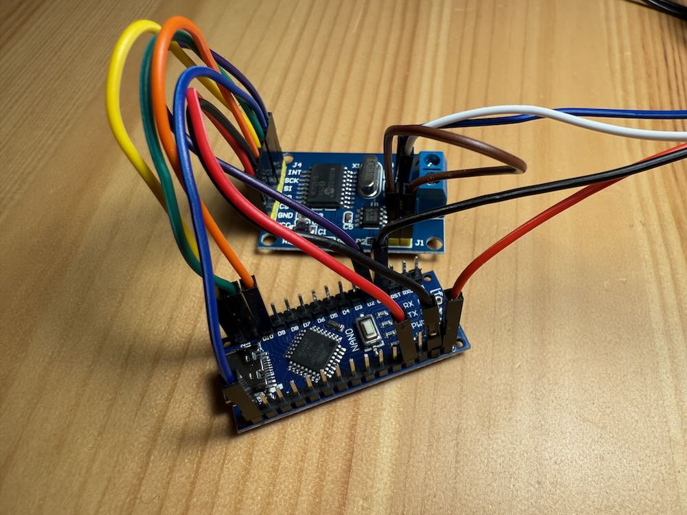

# CAN Helper
https://github.com/canhelper/canhelper

Основан на библиотеке: https://github.com/autowp/arduino-mcp2515

Презназначен для решения проблемы, возникающей при соединении двух CAN-адаптеров друг к другу напрямую.
Без CAN-устройств на шине, адаптеры могут читать из шины, но попытка записи завершается ошибкой. 

Такой модуль представляет из себя компактное и легко собираемое CAN-устройство, которое вешается на шину.

### Вам потребуется:
- Arduino Nano (рекомендую брать с USB type C)
- плата MCP2515 (или две, если вы хотите использовать сразу две CAN-шины одновременно)
- соединительные провода
- питание 12 Вольт

### Сборка

- установите Arduino IDE: https://www.arduino.cc/en/software. При установке предложит установить все нужные драйвера.
- откройте в IDE файл canhelper.ino
- подключите плату arduino usb-кабелем к компьютеру
- в IDE выберите из списка вашу плату и появившийся виртуальный COM-порт, попробуйте залить прошивку
- если всё залилось без ошибок, отключите arduino от компьютера, и соедините платы, как показано в таблице:

| Arduino Nano    | MCP2515 CAN1 | MCP2515 CAN2 (опционально) |
|-----------------|--------------|----------------------------|
| +5V             | VCC          | VCC                        |
| GND             | GND          | GND                        |
| D10             | CS           | -                          |
| D9              | -            | CS                         |
| D12             | SO           | SO                         |
| D11             | SI           | SI                         |
| D13             | SCK          | SCK                        |
| D2              | INT          | INT                        |
| -               | перемычка J1 | -                          |
| -               | -            | перемычка J1               |

- не забудьте перемычку J1 на MCP2515
- подключите MCP2515 к CAN-шине
- подключите (-) от источника питания на Arduino, пин GND (на плате два пина GND)
- подключите (+) от источника питания 12 Вольт на Arduino, пин VIN
- на Arduino и MCP2515 загорятся лампочки
- готово! Пробуйте что-нибудь записать вашим CAN-адаптером. Теперь должно записывать без ошибок.

### Возможные проблемы:
- #### При попытке загрузки прошивки возникает ошибка "avrdude: ser_open(): can't set com-state for "\\. \COM4""

Такая ошибка у меня возникала на партии arduino с алиэкспресс. В сети советуют установить другой драйвер, удалить и заново настроить устройство в диспетчере устройств, выбрать другой бутлоадер в IDE и т.п. Ничего из этого мне не помогло.

Решилось очень просто — заказал другой arduino из сетевого маркетплейса, и всё сразу же заработало.

- #### При загрузке прошивки множество ошибок "avrdude: stk500_recv(): programmer is not responding"

Попробуйте поменять процессор в настройках Arduino IDE. Меню Tools -> Processor -> выбрать ATmega328P (Old Bootloadder) 

